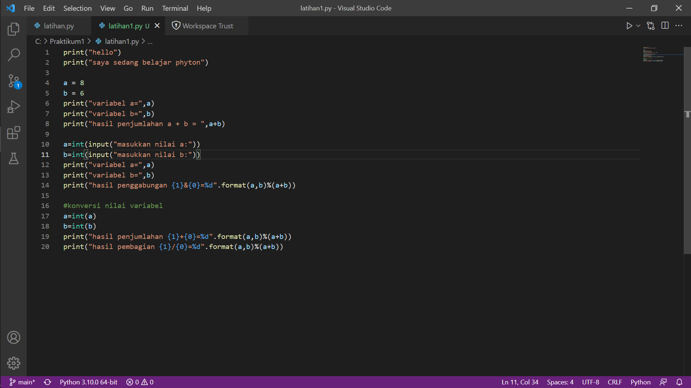
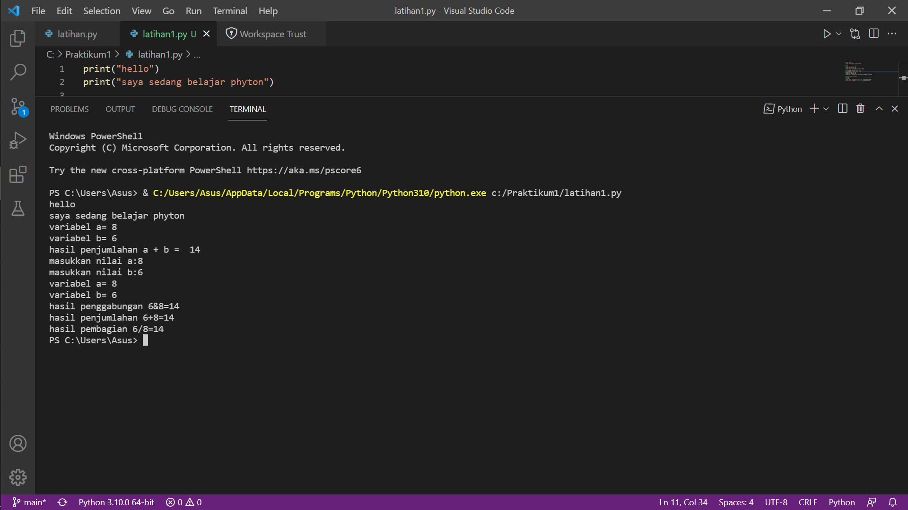

# Praktikum1
## Membuat Biodata

Berikut cara membuat program input data menggunakan phyton.

1. Terlebih dahulu buat input datanya, seperti contoh dibawah ini :

2. Setelah program dijalankan, maka akan muncul seperti ini

3. Isi sesuai biodata kalian, seperti contoh ini biodata saya

4. Lalu outputnya pun akan muncul 

## Program Penjumlahan dan pembagian

1. Terlebih dahulu buat input datanya seperti ini

2. Lalu hasilnya akan seperti ini

-SEKIAN-
